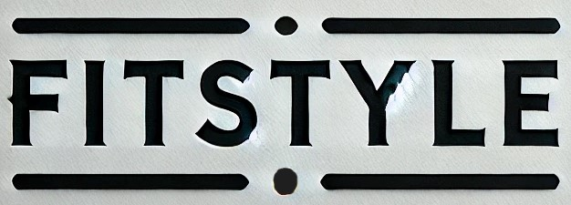

# 🛍️ FitStyle - E-Commerce React Project

<div align="center">



**A full-stack e-commerce application built with React, Material-UI, and modern web technologies**

[](https://reactjs.org/)
[](https://mui.com/)
[](https://vitejs.dev/)
[](https://tanstack.com/query)

</div>

---

## 📋 Table of Contents

- [🎯 Project Overview](#-project-overview)
- [🛠️ Tech Stack](#️-tech-stack)
- [🚀 Quick Start](#-quick-start)
- [📁 Project Structure](#-project-structure)
- [🔧 Development Setup](#-development-setup)
- [📚 API Documentation](#-api-documentation)
- [🎨 Component Architecture](#-component-architecture)
- [🔐 Authentication Flow](#-authentication-flow)
- [🛒 State Management](#-state-management)
- [📱 Responsive Design](#-responsive-design)
- [🌐 RTL Support](#-rtl-support)
- [🚀 Build & Deployment](#-build--deployment)
- [🐛 Known Issues](#-known-issues)
- [🤝 Contributing](#-contributing)

---

## 🎯 Project Overview

FitStyle is a modern e-commerce web application built with React and Material-UI. This project demonstrates full-stack development skills including:

- **Frontend**: React 18 with hooks, Material-UI components, and modern state management
- **Backend Integration**: RESTful API consumption with Axios and React Query
- **Authentication**: JWT-based auth with automatic token refresh
- **Admin Panel**: Complete CRUD operations for product and category management
- **Payment Integration**: Secure payment processing workflow
- **RTL Support**: Persian language support with right-to-left layout

### 🎯 **Learning Objectives**

- Modern React development patterns
- Material-UI component library usage
- State management with React Query and Redux Toolkit
- API integration and error handling
- Responsive design implementation
- Authentication and authorization flows

---

## 🛠️ Tech Stack

### **Core Technologies**

```json
{
  "react": "^18.2.0",
  "react-dom": "^18.2.0",
  "react-router-dom": "^6.26.1",
  "vite": "^4.2.0"
}
```

### **UI & Styling**

```json
{
  "@mui/material": "^6.1.1",
  "@mui/icons-material": "^6.1.1",
  "@emotion/react": "^11.13.3",
  "@emotion/styled": "^11.13.0",
  "stylis-plugin-rtl": "^2.1.1"
}
```

### **State Management**

```json
{
  "@tanstack/react-query": "^5.54.1",
  "@reduxjs/toolkit": "^2.7.0",
  "react-redux": "^9.2.0"
}
```

### **Additional Libraries**

```json
{
  "axios": "^1.7.4",
  "react-icons": "^5.5.0",
  "swiper": "^11.2.6",
  "react-infinite-scroll-component": "^6.1.0",
  "react-swipeable": "^7.0.2"
}
```

---

## 🚀 Quick Start

### **Prerequisites**

- Node.js >= 16.0.0
- npm >= 8.0.0 or yarn >= 1.22.0

### **Installation & Setup**

```bash
# Clone the repository
git clone <repository-url>
cd fitstyle

# Install dependencies
npm install

# Create environment file
cp .env.example .env

# Start development server
npm run dev
```

### **Environment Variables**

```env
VITE_API_URL=https://clothing-store.liara.run
VITE_APP_NAME=FitStyle
```

### **Available Scripts**

```bash
npm run dev      # Start development server
npm run build    # Build for production
npm run preview  # Preview production build
npm run lint     # Run ESLint (if configured)
```

---

## 📁 Project Structure

```
src/
├── components/
│   └── templates/
│       ├── adminPage/          # Admin panel components
│       │   ├── adminComponents/
│       │   │   ├── AddProductsForm.jsx
│       │   │   ├── CategoryForm.jsx
│       │   │   ├── ProductsView.jsx
│       │   │   └── ...
│       │   └── ProductCard.jsx
│       ├── homePage/           # Homepage components
│       │   ├── Banner.jsx
│       │   ├── CategorySlider.jsx
│       │   ├── ProductsSection.jsx
│       │   └── ...
│       └── layout/             # Layout components
│           ├── Header.jsx
│           ├── Footer.jsx
│           └── Layout.jsx
├── pages/                      # Route components
│   ├── Homepage.jsx
│   ├── AdminPage.jsx
│   ├── Shop.jsx
│   ├── Cart.jsx
│   └── ...
├── services/                   # API services
│   ├── productsApi.js
│   ├── cartApi.js
│   ├── auth.js
│   └── ...
├── hooks/                      # Custom hooks
│   ├── useCartMutation.js
│   ├── useFavoriteMutations.js
│   └── ...
├── contexts/                   # React contexts
│   └── ToastContext.jsx
├── configs/                    # Configuration files
│   ├── api.js
│   └── reactQuery.js
├── utils/                      # Utility functions
│   ├── cookie.js
│   └── getNewTokens.js
├── styles/                     # Global styles
│   ├── index.css
│   └── fonts.css
├── assets/                     # Static assets
│   ├── images/
│   ├── fonts/
│   └── videos/
├── router/
│   └── Router.jsx
└── mui/
    └── theme.js
```

---

## 🔧 Development Setup

### **Local Development**

```bash
# Install dependencies
npm install

# Start development server with hot reload
npm run dev

# The app will be available at http://localhost:5173
```

### **Code Structure**

- **Components**: Organized by feature (adminPage, homePage, layout)
- **Pages**: Route-level components
- **Services**: API integration layer
- **Hooks**: Custom React hooks for data fetching
- **Utils**: Helper functions and utilities

### **Development Tools**

- **Vite**: Fast build tool and dev server
- **React Query DevTools**: Debug server state
- **Material-UI**: Component library with theming

---

## 📚 API Documentation

### **Backend API**

- **Base URL**: `https://clothing-store.liara.run`
- **Authentication**: JWT-based with automatic refresh
- **Content Type**: `application/json` and `multipart/form-data`

### **API Services**

```javascript
// src/services/productsApi.js
-getProducts() - // Fetch all products
  fetchProductById(id) - // Get single product
  addProduct(data) - // Create new product
  editProduct(id, data) - // Update product
  getImageUrl(path) - // Process image URLs
  // src/services/cartApi.js
  addToCart(productId, quantity) -
  fetchCart() -
  increaseCartItemQuantity(productId, quantity) -
  decreaseCartItemQuantity(productId, quantity) -
  removeFromCart(productId) -
  clearCart() -
  // src/services/auth.js
  login(credentials) -
  register(userData) -
  logout() -
  getUserProfile();
```

### **Request/Response Interceptors**

```javascript
// Automatic token refresh on 401 errors
// Request/response logging
// Error handling and retry logic
```

---

## 🎨 Component Architecture

### **Component Organization**

```
components/
├── templates/
│   ├── adminPage/          # Admin-specific components
│   ├── homePage/           # Homepage components
│   └── layout/             # Shared layout components
```

### **Key Components**

- **ProductCard**: Reusable product display component
- **CategorySlider**: Interactive category navigation
- **AddProductsForm**: Admin product creation form
- **ImageModal**: Full-screen image viewing
- **Header/Footer**: Layout components

### **Custom Hooks**

```javascript
// src/hooks/
-useCartMutation.js - // Cart operations
  useFavoriteMutations.js - // Favorites management
  useOptimisticFavorites.js; // Optimistic updates
```

---

## 🔐 Authentication Flow

### **JWT Implementation**

```javascript
// Automatic token refresh
api.interceptors.response.use(
  (response) => response,
  async (error) => {
    if (error.response?.status === 401) {
      await getNewTokens();
      return api(originalRequest);
    }
    return Promise.reject(error);
  }
);
```

### **Route Protection**

```javascript
// Protected admin routes
<Route
  path="/admin"
  element={data?.user?.role === "admin" ? <AdminPage /> : <Navigate to="/" />}
/>
```

---

## 🛒 State Management

### **React Query Configuration**

```javascript
// src/configs/reactQuery.js
const defaultOptions = {
  queries: {
    staleTime: 5 * 60 * 1000, // 5 minutes
    retry: 1,
    retryDelay: 1000,
  },
};
```

### **State Structure**

- **Server State**: React Query for API data
- **Client State**: React Context for UI state
- **Form State**: Local component state

---

## 📱 Responsive Design

### **Material-UI Breakpoints**

```javascript
// Mobile-first approach
const theme = createTheme({
  breakpoints: {
    values: {
      xs: 0,
      sm: 600,
      md: 900,
      lg: 1200,
      xl: 1536,
    },
  },
});
```

### **Responsive Components**

- **Grid System**: Adaptive layouts
- **Drawer Navigation**: Mobile menu
- **Touch Gestures**: Swipeable components

---

## 🌐 RTL Support

### **Persian Language Implementation**

```javascript
// RTL cache configuration
const cacheRtl = createCache({
  key: "muirtl",
  stylisPlugins: [prefixer, rtlPlugin],
});
```

### **Font Integration**

```css
/* Vazirmatn font family */
@font-face {
  font-family: "Vazirmatn";
  src: url("./assets/fonts/Vazirmatn-Regular.ttf");
}
```

---

## 🚀 Build & Deployment

### **Vite Configuration**

```javascript
// vite.config.js
export default defineConfig({
  plugins: [react()],
  server: {
    host: "0.0.0.0",
    port: 5173,
    proxy: {
      "/upload": {
        target: "http://localhost:3000",
        changeOrigin: true,
      },
    },
  },
});
```

### **Build Commands**

```bash
npm run build    # Production build
npm run preview  # Preview build locally
```

### **Deployment**

- **Static Hosting**: Compatible with Vercel, Netlify
- **Environment Variables**: Configure API endpoints
- **Asset Optimization**: Automatic image optimization

---

## 🐛 Known Issues

### **Current Limitations**

- No TypeScript implementation (JavaScript only)
- Limited error boundary implementation
- No automated testing setup
- Image optimization could be improved

### **Future Improvements**

- [ ] Add TypeScript support
- [ ] Implement comprehensive testing
- [ ] Add PWA features
- [ ] Improve accessibility
- [ ] Add dark mode support

---

## 🤝 Contributing

### **Development Guidelines**

1. Fork the repository
2. Create a feature branch: `git checkout -b feature/new-feature`
3. Follow existing code patterns
4. Test your changes thoroughly
5. Submit a pull request

### **Code Style**

- Use functional components with hooks
- Follow Material-UI component patterns
- Maintain consistent file structure
- Add comments for complex logic

### **Pull Request Process**

- Provide clear description of changes
- Include screenshots for UI changes
- Ensure no console errors
- Test on multiple screen sizes

---

## 📄 License

This project is licensed under the MIT License.

---

## 🙏 Acknowledgments

- **React Team** - For the amazing framework
- **Material-UI Team** - For the comprehensive component library
- **Vite Team** - For the fast build tool
- **TanStack** - For React Query
- **All Open Source Contributors** - For the amazing tools

---

## 📞 Contact

**Developer**: Ali Khalaj  
**Email**: alikhalaj779@gmail.com

---

<div align="center">

**Built with ❤️ using React & Material-UI**

[⬆ Back to Top](#-fitstyle---e-commerce-react-project)

</div>
